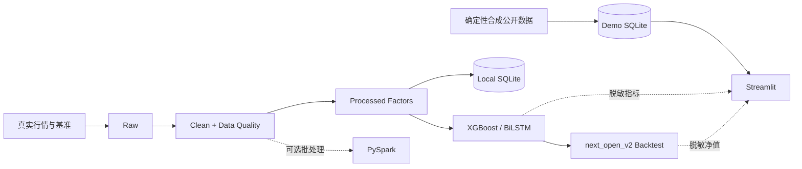

# 数据开发 · 量化研究作品集

> 数据科学与大数据技术 · Python / SQL / PySpark · 数据质量与分层存储 · 可解释量化研究

## 项目定位

本仓库当前主要作品是 [A 股量化数据工程与研究分析平台](projects/01-a-stock-quant-analysis/)：从行情接入、数据清洗、质量校验、因子加工和 SQLite 服务，到统一模型实验、可执行时序回测与 Streamlit 展示。作品集强调可复现流程和诚实研究结论，不把模型包装成盈利系统。

## Live Demo

**在线演示：<https://a-stock-quant-data-platform.streamlit.app/>**

公开网站使用确定性合成数据和本地真实研究结果的脱敏摘要，无需 Tushare Token，也不执行在线训练或实盘交易。

## Architecture

## Current Research Results

以下数字是当前唯一正式结果，来自同一次 Phase 3 实验。

| 模型 | Accuracy | AUC | Precision | Recall | F1 |
|---|---:|---:|---:|---:|---:|
| XGBoost | 52.71% | 0.5276 | 49.06% | 42.43% | 45.50% |
| BiLSTM | 51.43% | 0.5185 | 47.83% | 48.22% | 48.03% |

| `next_open_v2` 指标 | 结果 |
|---|---:|
| 策略收益 | -28.31% |
| 沪深 300 | +2.18% |
| 超额收益 | -30.49% |
| 最大回撤 | -37.32% |
| Sharpe | -0.88 |
| 平均换手率 | 77.95% |
| 成交 / 缺少开盘价阻塞 | 4,042 / 1 笔 |

两个模型的 AUC 都接近 0.5，没有证明稳定预测能力。策略没有获得超额收益，结果不构成投资建议。

## Data Scope

| 口径 | 范围 | 用途 |
|---|---|---|
| 本地真实研究数据 | 364 只股票、562,789 条因子记录的验收快照 | 因子、模型和回测研究 |
| 公开 Demo 数据 | 5,200 个合成资产目录、300 个合成资产明细和预聚合 | 页面体验、查询和部署 |
| 模型与回测快照 | 本地真实研究结果的脱敏指标、重要性和归一化净值 | 公开展示当前研究结论 |

公开 Demo 的 5,200 个资产是固定随机种子生成的合成标识，不是 5,200 只真实股票行情。真实原始行情、研究数据库、模型权重、逐行预测和持仓不会提交。

## Engineering Highlights

- Raw → Clean → Processed → Serving 分层数据流和来源记录。
- 重复键、缺失、OHLC、价格和成交量质量检查。
- SQLite 唯一约束、事务化分块 upsert、索引和参数化查询。
- XGBoost 与 BiLSTM 使用统一任务、特征、时间边界和完整测试目标。
- T 日收盘信号、T+1 开盘调仓、真实基准、费用、滑点和订单阻塞统计。
- 确定性 Demo、公开只读服务库、十页 Streamlit 烟雾测试和 GitHub Actions CI。
- PySpark 清洗、窗口因子、分区 Parquet 与 Spark SQL 的可选批处理链路。

## Research Limitations

- 股票池历史变化、退市样本、复权口径、停牌和逐日涨跌停字段仍不完整。
- 固定滑点不能完整模拟盘口、成交量约束和市场冲击。
- 来源未验证的情绪数据被排除，不能声称情绪因子提高了模型表现。
- PySpark 当前是批处理实现，不是生产 Spark 集群。
- 当前没有 Kafka、Flink 或 Airflow 生产链路。
- SQLite 与 Streamlit 服务不能描述为生产级量化交易系统。
- 项目不是 AI 交易机器人，不保证收益。

## Testing

当前本地验收：

- Python 语法检查通过；
- `compileall` 通过；
- 26 项测试和 5 项参数化子测试通过；
- 10 个现有 Streamlit 页面通过公开模式烟雾测试。

验证命令、运行方式、完整架构和结果解释见 [项目 README](projects/01-a-stock-quant-analysis/README.md)。

## About Me

我是一名数据科学与大数据技术专业本科毕业生，主要学习与实践方向是数据处理、数据库应用和量化数据分析。项目中的代码、数据链路、研究流程和展示由本人独立完成并持续整理。

## Skills

- **Programming:** Python、Pandas、NumPy
- **Database / SQL:** MySQL 课程学习、SQLite 项目实践、参数化查询、唯一约束、增量 Upsert、分析 SQL
- **Data Engineering:** 数据分层、质量校验、PySpark、Parquet、批处理
- **Quant Research:** Tushare、AKShare、技术因子、样本外模型验证、含成本回测
- **Visualization:** Streamlit、Plotly、Matplotlib
- **Machine Learning:** Scikit-learn、XGBoost、PyTorch BiLSTM
- **Development:** Git、GitHub Actions、Linux、VS Code

## Career Goal

目标岗位包括量化数据开发、数据开发、数据分析和 Python 数据方向。面试时重点讲解数据来源、质量规则、服务层设计、时间序列隔离、回测执行口径，以及为什么当前弱结果不能被解释为交易优势。

## License

项目代码使用 [MIT License](projects/01-a-stock-quant-analysis/LICENSE)。
