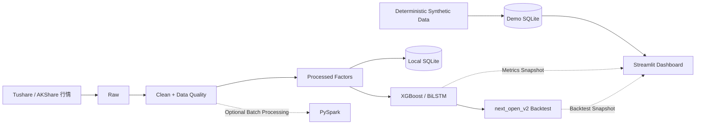

# A 股量化研究分析平台

> A-share quantitative research analysis project covering data engineering, feature research, machine-learning validation, executable backtesting, and an interactive Streamlit Dashboard.

## Project Overview

本项目构建了一条面向 A 股日频研究的数据链路：采集并清洗行情数据，执行质量校验，生成技术因子，通过时间序列切分验证 XGBoost 与 BiLSTM 分类模型，再使用 `next_open_v2` 回测检验样本外信号在交易成本和可执行时序下的表现。

项目源码位于 [`projects/01-a-stock-quant-analysis/`](projects/01-a-stock-quant-analysis/)。研究目标是保证数据、实验和结果可追溯，不以收益率或高指标作为项目成立的前提。

## Live Demo

**在线演示：<https://a-stock-quant-data-platform.streamlit.app/>**

Public Demo Mode 使用固定随机种子生成的合成行情和本地研究结果的脱敏摘要。在线页面不读取真实逐日行情、不执行在线训练，也不提供交易执行能力。

Streamlit 入口文件：

```text
projects/01-a-stock-quant-analysis/app_pro.py
```

## Features

- **Data Engineering**：Tushare 数据接入、Raw/Clean/Processed 分层、质量规则和 SQLite 服务层。
- **Feature Research**：21 个正式技术因子、因子走势、相关性和 IC 分析。
- **Machine Learning**：XGBoost 与 BiLSTM 的下一交易日涨跌分类实验，统一股票池、特征和时间边界。
- **Backtesting**：T 日收盘形成信号、T+1 开盘执行，计入佣金、印花税和滑点。
- **Dashboard**：10 个 Streamlit 页面，覆盖数据质量、市场分析、因子、模型和策略研究。
- **Quality Assurance**：单元测试、数据链路测试、10 页 Streamlit smoke test 和 GitHub Actions CI。

## System Architecture


```mermaid
flowchart LR
    A[Tushare / AKShare 行情] --> B[Raw]
    B --> C[Clean + Data Quality]
    C --> D[Processed Factors]
    D --> E[XGBoost / BiLSTM]
    E --> F[next_open_v2 Backtest]
    D --> G[(Local SQLite)]

    H[Deterministic Synthetic Data] --> I[(Demo SQLite)]
    I --> J[Streamlit Dashboard]
    E -. Metrics Snapshot .-> J
    F -. Backtest Snapshot .-> J
    C -. Optional Batch Processing .-> K[PySpark]
```

## Data Description

| 数据范围 | 内容 | 用途 |
|---|---|---|
| 本地研究数据 | 364 只股票、562,789 条因子记录的验收快照 | 因子研究、模型训练和回测 |
| Public Demo 数据 | 5,200 个合成资产目录、300 个合成资产明细及预聚合 | 页面查询、部署和可重复演示 |
| 模型与回测摘要 | 本地研究结果的脱敏指标、重要性和归一化净值 | 公开展示当前研究结论 |

Public Demo 中的 5,200 个资产是确定性合成标识，不是 5,200 只真实股票行情。真实原始行情、完整研究数据库、模型权重、逐样本预测和逐日持仓不进入 Git。

## Feature Engineering

正式模型输入由 21 个技术因子组成，覆盖收益与价格关系、均线、动量、反转、波动率、布林带、成交量和成交额。XGBoost 与 BiLSTM 使用相同特征集合。字段定义见 [`docs/FEATURE_DEFINITION.md`](docs/FEATURE_DEFINITION.md)。

## Model

任务统一为预测下一交易日涨跌方向。训练、验证和测试采用按时间排序的 70%/15%/15% 切分，并剔除跨分区引用下一日标签的边界信号日。

| 模型 | Accuracy | AUC | Precision | Recall | F1 |
|---|---:|---:|---:|---:|---:|
| XGBoost | 52.71% | 0.5276 | 49.06% | 42.43% | 45.50% |
| BiLSTM | 51.43% | 0.5185 | 47.83% | 48.22% | 48.03% |

## Backtesting

`next_open_v2` 在 T 日收盘后生成信号，在 T+1 开盘执行调仓。成本模型包含买卖双边 0.03% 佣金、卖出单边 0.05% 印花税和买卖各 0.10% 固定滑点。

| 指标 | 结果 |
|---|---:|
| 策略收益 | -28.31% |
| 沪深 300 | +2.18% |
| 超额收益 | -30.49% |
| 最大回撤 | -37.32% |
| Sharpe | -0.88 |
| 平均换手率 | 77.95% |
| 成交 / 缺少开盘价阻塞 | 4,042 / 1 笔 |

当前模型只表现出较弱的样本外统计信号，策略没有获得超额收益。

## Limitations

- 股票池历史变化、退市样本、复权口径、停牌和逐日涨跌停状态仍不完整。
- 固定滑点不能完整模拟盘口、成交量约束和市场冲击。
- 来源未验证的情绪数据被排除，当前结果不能证明情绪因子有效。
- PySpark 是可选批处理实现，不代表生产 Spark 集群运行。
- SQLite 与 Streamlit 面向单机研究和只读演示，不提供生产交易基础设施。
- 所有结果仅用于研究分析，不构成投资建议或收益承诺。

## Installation and Usage

### Public Demo Mode

无需数据源 Token：

```powershell
cd projects/01-a-stock-quant-analysis
python -m venv .venv
.venv\Scripts\activate
python -m pip install -r requirements.txt
python scripts/prepare_demo.py
python -m streamlit run app_pro.py
```

### Local Research Workflow

真实研究链路需要数据采集和模型依赖：

```powershell
cd projects/01-a-stock-quant-analysis
python -m pip install -r requirements-model.txt
$env:TUSHARE_TOKEN = "your-token"
python fetch_stock_data.py
python fetch_sentiment.py --mode real
python data_preprocessing.py
python factor_engineering_with_sentiment.py
python model_training.py
python backtest.py
```

## Testing

```powershell
cd projects/01-a-stock-quant-analysis
python -m pip install -r requirements-test.txt
python -m compileall -q -x "archive([\\/]|$)" .
python -m pytest -q
$env:QUANT_APP_MODE = "portfolio"
python scripts/smoke_test_app.py
```

CI 工作流位于 [`.github/workflows/quality.yml`](.github/workflows/quality.yml)，覆盖 Python 3.10 和 3.11。

## Repository Structure

```text
.
├── README.md
├── docs/                              # 技术说明和历史记录
├── .github/workflows/quality.yml
└── projects/01-a-stock-quant-analysis/
    ├── app_pro.py                     # Streamlit Dashboard
    ├── app/                           # 数据访问与分析模块
    ├── scripts/                       # Demo、建库、基准和 smoke test
    ├── tests/                         # 单元与链路测试
    ├── portfolio_data/                # 合成 Demo 与脱敏结果
    ├── reports/                       # 当前实验和性能摘要
    ├── model_training.py
    ├── backtest.py
    └── README.md                      # 完整项目技术说明
```

## License

项目代码使用 [MIT License](projects/01-a-stock-quant-analysis/LICENSE)。
