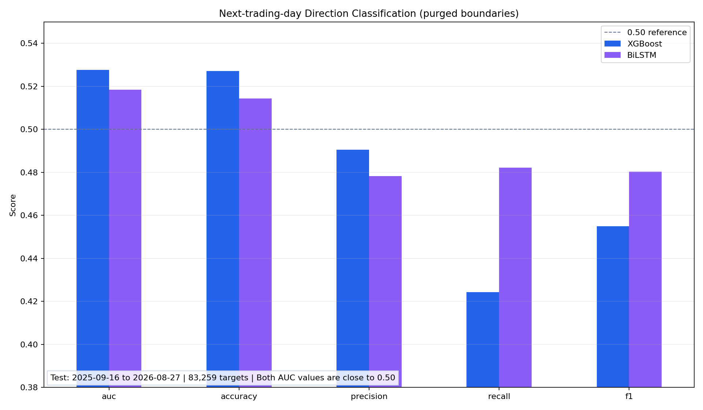
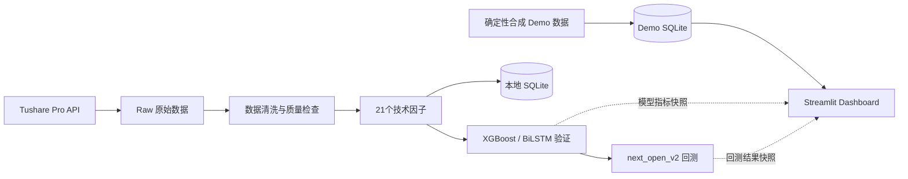

# A股机器学习量化研究平台

> Machine Learning Quantitative Research Platform

[](projects/01-a-stock-quant-analysis/requirements.txt)
[](projects/01-a-stock-quant-analysis/tests)
[](https://github.com/duerm85-cell/data-analysis-portfolio/actions/workflows/quality.yml)
[](projects/01-a-stock-quant-analysis/LICENSE)

**在线 Demo：** <https://a-stock-quant-data-platform.streamlit.app/>

## 项目简介

这是一个本科阶段完成并持续工程化整理的个人数据分析项目，围绕 A 股日频数据构建完整研究流程：

```text
数据采集 → 数据清洗 → 特征工程 → 机器学习验证 → 策略回测 → Streamlit 可视化
```

项目重点是把数据来源、处理过程、实验口径、回测时序和研究限制说明清楚。当前模型只有较弱的样本外区分能力，策略没有获得超额收益；这些结果在项目中如实保留，不将项目描述为自动交易系统或稳定盈利策略。



## 项目功能

1. **数据处理**：采集日频行情，完成 Raw、Clean、Processed 分层、字段统一和数据质量检查。
2. **因子分析**：构建并分析 21 个正式模型输入技术因子，展示因子走势、相关性和 IC 结果。
3. **模型训练**：使用相同股票池、特征和时间边界验证 XGBoost 与 BiLSTM 的下一交易日涨跌分类能力。
4. **回测分析**：使用 T 日收盘信号、T+1 开盘执行的 `next_open_v2` 回测，并计入佣金、印花税和滑点。
5. **Streamlit 展示**：通过 10 个页面展示数据质量、市场结构、因子、模型、策略和系统流程。

## 技术栈

| 类别 | 技术 |
|---|---|
| 数据处理 | Python、Pandas、NumPy |
| 数据存储 | SQLite、Parquet |
| 机器学习 | scikit-learn、XGBoost、PyTorch、BiLSTM |
| 可视化 | Streamlit、Plotly |
| 测试与协作 | pytest、Git、GitHub Actions |
| 可选批处理 | PySpark |

PySpark 仅作为批处理实现示例，不代表项目运行在生产 Spark 集群中。

## 系统架构


```mermaid
flowchart LR
    A[Tushare Pro API] --> B[Raw 原始数据]
    B --> C[数据清洗与质量检查]
    C --> D[21个技术因子]
    D --> E[XGBoost / BiLSTM 验证]
    E --> F[next_open_v2 回测]
    D --> G[(本地 SQLite)]

    H[确定性合成 Demo 数据] --> I[(Demo SQLite)]
    I --> J[Streamlit Dashboard]
    E -. 模型指标快照 .-> J
    F -. 回测结果快照 .-> J
```

项目代码位于 [`projects/01-a-stock-quant-analysis/`](projects/01-a-stock-quant-analysis/)，详细设计见 [`docs/PROJECT_DESIGN.md`](docs/PROJECT_DESIGN.md)。

## 数据说明

项目明确区分公开展示与本地研究两种数据模式：

| 模式 | 数据 | 用途 |
|---|---|---|
| Demo Mode | 固定随机种子生成的合成行情、资产标识和预聚合结果 | 公开页面、SQLite 查询和运行演示 |
| Research Mode | 使用个人 Tushare Pro Token 获取的本地日频 OHLCV 数据 | 因子研究、模型训练和回测 |

公开 Demo 中的 5,200 个资产是合成标识，不代表 5,200 只真实股票。GitHub 不上传真实原始行情、完整研究数据库、模型权重、逐行预测或每日持仓。

数据来源、股票池和复现边界见 [`docs/DATA_SOURCE.md`](docs/DATA_SOURCE.md)。24 个候选字段、21 个正式模型输入和 17 个公开 IC 展示字段的区别见 [`docs/FEATURE_DEFINITION.md`](docs/FEATURE_DEFINITION.md)。

## 模型说明

主要任务是预测下一交易日涨跌方向。XGBoost 和 BiLSTM 使用相同的 21 个技术因子，并按时间顺序进行 70%/15%/15% 的训练、验证和测试切分，避免随机切分引入未来信息。

| 模型 | Accuracy | AUC | Precision | Recall | F1 |
|---|---:|---:|---:|---:|---:|
| XGBoost | 52.71% | 0.5276 | 49.06% | 42.43% | 45.50% |
| BiLSTM | 51.43% | 0.5185 | 47.83% | 48.22% | 48.03% |

这些指标接近随机基线，不能证明模型具有稳定预测能力。公开 Demo 只加载实验指标和特征重要性快照，不在线训练模型。

## 回测说明

`next_open_v2` 在 T 日收盘后生成信号，于 T+1 开盘调仓。成本模型包括买卖双边 0.03% 佣金、卖出单边 0.05% 印花税，以及买卖各 0.10% 固定滑点。

| 指标 | 当前结果 |
|---|---:|
| 策略收益 | -28.31% |
| 沪深 300 基准 | +2.18% |
| 超额收益 | -30.49% |
| 最大回撤 | -37.32% |
| Sharpe | -0.88 |
| 平均换手率 | 77.95% |
| 成交订单 | 4,042 |
| 缺少开盘价阻塞 | 1 |

策略没有跑赢基准。高换手、交易成本和较弱的模型信号共同影响了结果。

## Dashboard 页面

10 个页面按研究流程分组：

- **DATA ENGINEERING**：数据平台、数据洞察
- **MARKET ANALYSIS**：市场总览、股票画像、行业分析、情绪分析
- **FACTOR & ML RESEARCH**：因子研究、模型验证
- **STRATEGY RESEARCH**：策略回测
- **SYSTEM**：系统概览

Streamlit 入口为 [`projects/01-a-stock-quant-analysis/app_pro.py`](projects/01-a-stock-quant-analysis/app_pro.py)。

## 项目限制

- 当前模型指标没有证明稳定预测能力，回测也没有获得超额收益。
- 历史股票池变化、退市样本、复权口径、停牌和每日涨跌停数据仍不完整。
- 固定滑点不能完整模拟盘口深度、成交量约束和市场冲击。
- 情绪字段存在来源边界，未核验的数据不会进入正式模型实验。
- Demo Mode 使用合成数据，模型和回测面板展示的是本地研究结果摘要。
- SQLite 和 Streamlit 面向个人研究与只读展示，不是专业投资或实盘交易系统。

本项目仅用于数据分析与研究，不构成投资建议或收益承诺。

## 运行方式

### 快速运行 Demo

需要 Python 3.10 或 3.11。使用 GNU Make：

```bash
git clone https://github.com/duerm85-cell/data-analysis-portfolio.git
cd data-analysis-portfolio
make demo
```

没有 GNU Make 时：

```bash
bash run_demo.sh
```

也可以手动运行：

```bash
cd projects/01-a-stock-quant-analysis
python -m pip install -r requirements.txt
python scripts/prepare_demo.py
python -m streamlit run app_pro.py
```

### 本地研究模式

以 [`.env.example`](.env.example) 为环境变量名称参考，在本机设置 `TUSHARE_TOKEN`，不要把真实 Token 写入 Git。

```bash
cd projects/01-a-stock-quant-analysis
python -m pip install -r requirements-model.txt
export TUSHARE_TOKEN="your-token"
python fetch_stock_data.py
python data_preprocessing.py
python factor_engineering_with_sentiment.py
python model_training.py
python backtest.py
```

## 测试

```bash
cd projects/01-a-stock-quant-analysis
python -m pip install -r requirements-test.txt
python -m pytest -q
QUANT_APP_MODE=portfolio python scripts/smoke_test_app.py
```

GitHub Actions 会执行 Python 编译检查、pytest 和 10 个 Streamlit 页面 smoke test。

## 目录结构

```text
.
├── README.md
├── Makefile
├── run_demo.sh
├── docs/                              # 数据来源、字段和设计说明
├── .github/workflows/quality.yml      # CI
└── projects/01-a-stock-quant-analysis/
    ├── app_pro.py                     # Streamlit 入口
    ├── app/                           # 页面与数据访问模块
    ├── scripts/                       # Demo、建库和 smoke test
    ├── tests/                         # 单元与链路测试
    ├── portfolio_data/                # 合成 Demo 与脱敏结果
    ├── model_training.py
    └── backtest.py
```

## License

项目代码使用 [MIT License](projects/01-a-stock-quant-analysis/LICENSE)。
