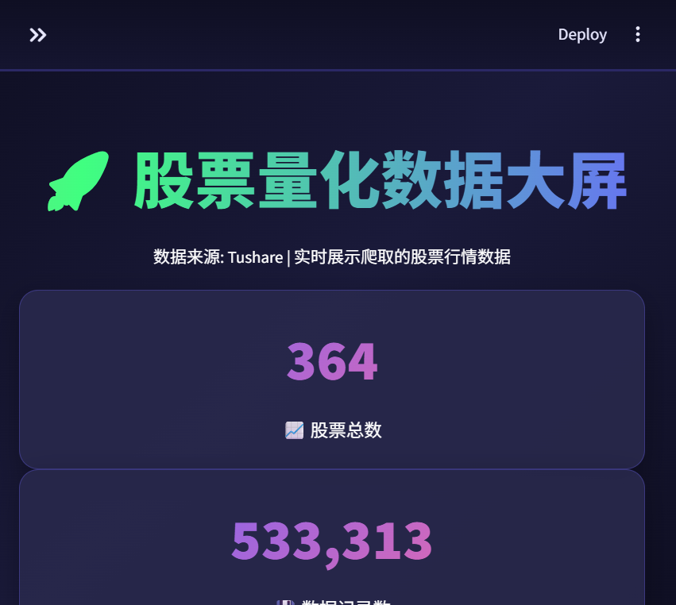
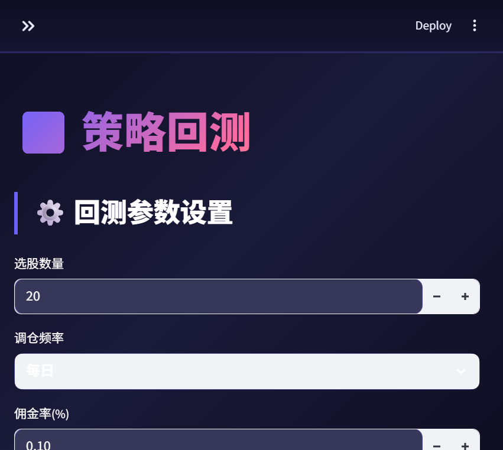
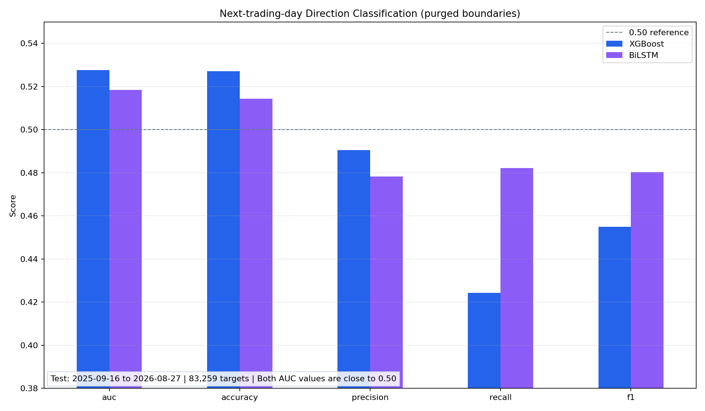
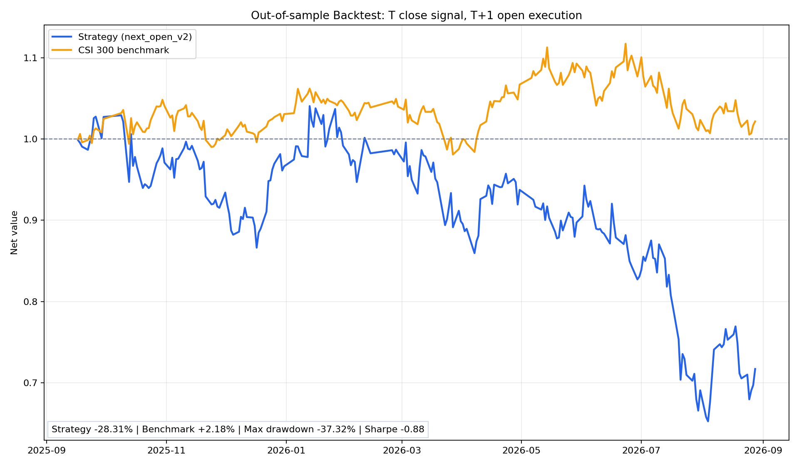

# A股因子分析与机器学习预测项目

<p>
  
  
  
  
  
  
</p>

> 基于多因子 + 市场情绪融合的 A 股量化选股分析系统（毕业设计）

这是一个基于 A 股市场数据和 Python 的数据分析项目，主要做的是：从原始行情数据开始，构建技术因子、情绪因子，再用机器学习和时序模型去尝试预测股票涨跌方向，并做一些简单的回测与效果展示。

这个项目更偏向“数据分析 + 量化研究 + Python 实践”，不是一个包装过度的交易系统，也不是一个只跑模型的 demo。它的重点是体现我能把一个实际问题拆成数据处理、特征工程、建模分析和结果解释这一整套流程。

## 项目目的

这个项目的核心问题其实很简单：

- 能不能用历史行情和一些常见因子来判断未来涨跌？
- 哪些特征对预测更有帮助？
- 不同模型的效果差异怎么样？
- 结果能不能做成一个可展示的分析流程？

我做这个项目的目的是把一个比较典型的金融数据分析问题完整走一遍：

1. 数据获取
2. 数据清洗
3. 因子构造
4. 模型训练
5. 评估结果
6. 简单回测
7. 可视化展示

---

## 系统截图

<!-- 把应用运行时截取的界面截图放到 docs/screenshots/ 目录，再把下面的文件名改成实际的即可 -->

<p align="center">
  
  
  
  
  <br>
  <em>※ 演示图位置：运行后替换为实际截图</em>
</p>

---

## 项目内容

### 1. 数据获取
- 获取 A 股日线行情数据
- 用 Tushare、AKShare 等方式补充市场数据
- 也加入一部分情绪/文本信号

### 2. 因子构建
这部分是项目的重点之一。我做了几类常见因子：

- 动量因子：5日收益率、20日动量、反转信号
- 趋势因子：MA5、MA10、MA20、MACD、RSI
- 波动因子：波动率、布林带位置
- 情绪因子：新闻情绪值等

这些因子主要是把市场状态转成更适合模型使用的特征。

### 3. 模型训练
我比较了两种思路：

- XGBoost：适合处理结构化表格数据
- LSTM：适合处理时间序列数据，捕捉前后时间步的依赖关系

### 4. 评估与回测
- 使用时间切分来避免数据泄露
- 评估模型的准确率、AUC 和误差
- 做了简单的策略回测和可视化展示

---

## 实际效果

我这边的结果是：

| 模型 | Accuracy | AUC | MSE |
|------|----------|-----|-----|
| XGBoost | 51.77% | 0.5346 | 0.2498 |
| LSTM (BiLSTM) | 54.90% | 0.5181 | 0.2476 |

这个结果说明模型确实有一定的学习能力，但也说明股票预测本身是一个非常难的问题。它不是一个“很强的交易模型”，而更像一个研究性的数据分析项目。

---

## 为什么这个项目能拿去面试

它的价值在于，我能很清楚地讲出：

- 我会拿数据
- 我知道怎么清洗和整理
- 我会做特征工程
- 我会选模型并比较
- 我会做评估和解释
- 我知道结果有限、也知道风险在哪里

这比单纯说“我做了一个 AI 预测股票项目”更有说服力。

---

## 项目结构

```text
pythonProject2bishe/
├── app_pro.py                          # Streamlit 主应用入口
├── backtest.py                         # 回测逻辑
├── database_manager.py                 # SQLite 数据管理
├── data_preprocessing.py               # 数据清洗与预处理
├── factor_engineering.py               # 技术因子构建
├── factor_engineering_with_sentiment.py # 情绪因子增强版
├── fetch_stock_data.py                 # 行情数据抓取
├── fetch_sentiment.py                  # 情绪数据抓取
├── model_training.py                   # XGBoost / LSTM 模型训练
├── training_log.json                   # 训练日志
├── run_app.bat                         # Windows 启动脚本
├── data/                               # 数据目录
│   ├── raw/
│   ├── clean/
│   └── processed/
├── results_optimized/                  # 训练与评估结果
├── backtest_results/                   # 回测输出
├── archive/                            # 历史版本
├── README.md
└── .github/agents/
```

---

## 我会怎么讲给面试官

我会这么说：

> 这个项目是我做的一个 A 股因子分析和预测项目。整体流程是从数据获取、数据清洗、因子构建、模型训练到回测分析。我主要做的是把金融数据转成可以分析的特征，再用 XGBoost 和 LSTM 去做分类预测，同时比较不同模型的效果。这个项目的价值不在于声称我能稳定赚钱，而在于它体现了我具备完整的数据分析流程和建模思路，并且我也知道股票预测本身存在很大的噪声和不确定性。

这个表述比较稳，也不容易“露馅”。

---

## 诚实的局限

这个项目不能说成“高收益量化策略”。更准确地说，它是：

- 一个数据分析项目
- 一个 Python 建模项目
- 一个金融数据处理和评估项目

它的局限也很明确：

- A 股行情本身噪声很大
- 历史因子不一定能稳定带来收益
- 预测结果受样本和市场环境影响很大
- 它更偏研究型探索，不等于可上线交易策略

这些局限我自己知道，也会在面试里坦诚说明。

---

## 这份项目最适合什么岗位

它最适合放在这些方向里：

- 数据分析师
- 数据分析相关岗位
- 数据科学 / 机器学习方向
- 金融数据分析岗
- 量化分析岗

如果岗位更偏“业务分析型”，我会强调数据链路、清洗和可视化；如果岗位更偏“数据科学型”，我会强调建模、特征工程和评估方法。

---

## 我建议的展示方式

不要过度包装成“量化交易系统”。更好的方式是：

1. 说清楚这是一个股票数据分析与预测项目
2. 说明做了什么数据处理和建模
3. 说明结果不错但有限
4. 说明自己知道问题和风险

这样会更像一个成熟的求职者，而不是一个在包装营销产品。

---

## 运行方式

### 安装依赖

```bash
pip install streamlit pandas numpy plotly torch xgboost scikit-learn scipy matplotlib tushare akshare snownlp
```

### 启动

```bash
python -m streamlit run app_pro.py --server.port 8501
```

或直接运行：

```bash
run_app.bat
```

---

## 结论

这个项目非常适合做毕业设计/个人作品/面试作品；但它的包装方向应该是“真实、简洁、可讲明白”，而不是“高大上、很像专业量化团队作品”。

我觉得最稳的做法，是把它描述成：

> 一个基于股票数据的因子分析和预测项目，体现了我在数据处理、特征工程、机器学习和结果分析方面的能力。

这句话简短，也最容易自己讲清楚。
---

## 技术栈

| 类别 | 技术 | 用途 |
|------|------|------|
| 语言 | Python | 数据处理、建模与分析 |
| 数据处理 | Pandas, NumPy | 清洗、合并、时间序列处理 |
| 可视化 | Plotly, Streamlit | 可交互分析与结果展示 |
| 机器学习 | XGBoost, scikit-learn | 分类建模与特征评估 |
| 深度学习 | PyTorch, LSTM | 时间序列预测 |
| 数据库 | SQLite | 本地数据管理与存储 |
| 数据源 | Tushare, AKShare | A 股行情及补充数据 |
| 情绪分析 | SnowNLP | 新闻/文本情绪信号 |

---

## 数据与特征工程

### 1. 数据来源
- A 股日线行情数据
- 基本面和市场相关补充数据
- 新闻/文本情绪信号

### 2. 特征构建
项目基于技术分析和市场微观信号构建了多类因子，包括：

- 动量因子：5日收益率、20日动量、反转信号
- 趋势因子：MA5、MA10、MA20、MACD、RSI
- 波动因子：波动率、布林带位置、高低价比率
- 情绪因子：新闻情绪值、动量均线等

这些特征的目标是把市场状态转化为可建模的变量，以便输入分类或时序预测模型。

---

## 模型设计

项目中比较了两类方法：

### XGBoost
- 使用结构化表格数据
- 对特征进行工程化处理
- 擅长处理非线性关系与交互效应

### LSTM
- 使用时间序列窗口
- 关注过去若干时间步对当前状态的影响
- 适合捕捉序列依赖和时序模式

### 实际评估结果

| 模型 | Accuracy | AUC | MSE |
|------|----------|-----|-----|
| XGBoost | 51.77% | 0.5346 | 0.2498 |
| LSTM (BiLSTM) | 54.90% | 0.5181 | 0.2476 |

结果表明：
- 模型在数据集上具备一定的可学习性
- 时间序列模型在部分场景中略优于树模型
- 但整体预测能力仍然有限，说明市场预测是高噪声、高不确定性的任务

---

## 回测与分析展示

项目不仅训练了模型，还进行了历史回测与结果展示，包括：

- Top-N 选股逻辑
- 回测绩效指标
- 选股组合收益分析
- 模型对比与可视化结果

这使项目更接近真实分析流程，而不仅是“模型跑通”式的实验。

---

## 项目结构

```text
pythonProject2bishe/
├── app_pro.py                          # Streamlit 主应用入口
├── backtest.py                         # 回测逻辑
├── database_manager.py                 # SQLite 数据管理
├── data_preprocessing.py               # 数据清洗与预处理
├── factor_engineering.py               # 技术因子构建
├── factor_engineering_with_sentiment.py # 情绪因子增强版
├── fetch_stock_data.py                 # 行情数据抓取
├── fetch_sentiment.py                  # 情绪数据抓取
├── model_training.py                   # XGBoost / LSTM 模型训练
├── training_log.json                   # 训练日志
├── run_app.bat                         # Windows 启动脚本
├── data/                               # 数据目录
│   ├── raw/
│   ├── clean/
│   └── processed/
├── results_optimized/                  # 模型评估与结果文件
├── backtest_results/                   # 回测输出
├── archive/                            # 历史版本与备份
├── README.md                           # 项目说明
└── .github/agents/                     # 自定义 agent 配置
```

---

## 运行方式

### 环境要求
- Windows 10 / 11
- Python 3.10+
- 建议使用 Anaconda 或 Python 虚拟环境

### 安装依赖

```bash
pip install streamlit pandas numpy plotly torch xgboost scikit-learn scipy matplotlib tushare akshare snownlp
```

### 启动应用

```bash
python -m streamlit run app_pro.py --server.port 8501
```

或者直接运行：

```bash
run_app.bat
```

---

## 适合岗位的项目价值

这个项目最适合放在以下岗位方向的作品集中：

- 数据分析师
- 数据科学家
- 量化分析岗
- 数据挖掘 / 机器学习工程岗
- 金融数据分析相关岗位

它的优势在于：

1. 覆盖从数据到分析再到结果解释的全流程
2. 使用真实数据和时间序列问题场景
3. 具备实际的 Python 数据工程与机器学习实践
4. 兼具业务场景与技术实现能力

---

## 诚实的局限性

这是一个非常适合展示的项目，但在面试和求职中需要诚实地说明其边界：

- A 股市场预测本身具有很强的噪声与非稳定性
- 仅靠历史因子和模型，很难稳定地产生可持续 alpha
- 结果受样本窗口、数据质量、事件影响和市场环境变化影响较大
- 该项目更偏分析型与研究型探索，不等同于可上线交易系统

这恰恰也是一个更成熟作品的体现：不是“夸大结论”，而是“清晰描述方法与限制”。

---

## 面试口播建议

如果用于面试，你可以这样说：

> 这个项目我做的是一套从数据拉取到因子构建、模型训练和回测分析的完整流程。它的重点不是简单做一个预测模型，而是试图建立一套时间序列分析框架，用历史市场特征去理解股市趋势变化，并比较不同模型的表现。我也特别关注数据泄露问题、时间切分和结果解释，这些都是我在做数据分析时非常重视的实际工程经验。

---

## 进一步优化建议

如果想把它打磨成更强的 GitHub 面试作品，可以继续做下面几件事：

1. 补充更清晰的项目首页图和效果截图
2. 撰写更完整的项目架构说明和分析流程图
3. 增加 Feature Importance / 因子解释分析
4. 增加单一指标与多指标的对比分析
5. 提炼出一份“项目亮点 + 面试自述”文档
6. 把 archive 目录里的旧版本从主仓库展示中剥离，避免让作品看起来杂乱

---

## License

MIT License

---

## 结论

这个项目是可行的，并且非常适合做 GitHub 数据分析类作品。它的价值不在于“模型是否真的能赚钱”，而在于展示你具备：

- 数据收集与清洗能力
- 特征工程思维
- 机器学习/深度学习应用能力
- 结果分析与表达能力
- 正确面对模型局限的职业性

如果你把它进一步整理成一份更清晰的 README、带上项目亮点和面试说明，那么它完全可以作为你求职时的敲门砖。