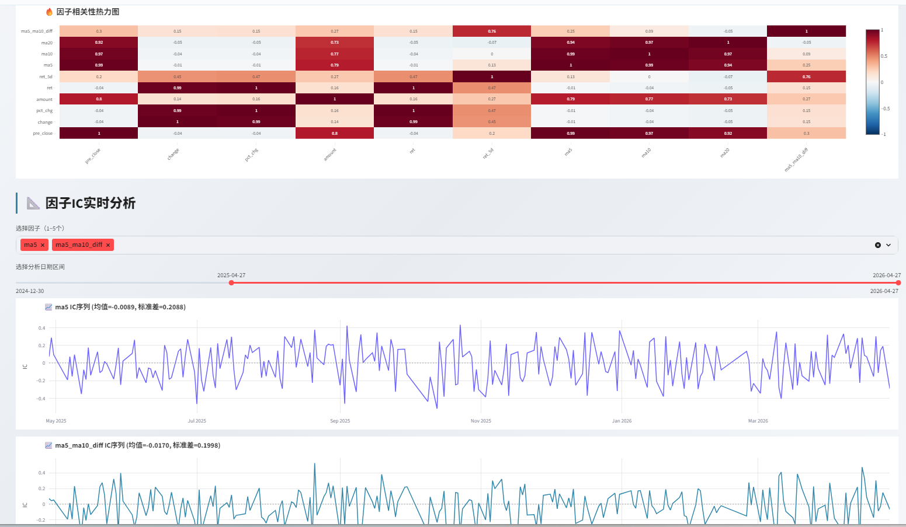

# A股多因子量化分析系统

<p>
  
  
  
  
  
  
</p>

> 金融数据流水线 + 量化分析应用：Tushare/AKShare 数据获取 → 清洗校验 → 分层落盘（CSV / Parquet / SQLite）→ 因子计算 → XGBoost / BiLSTM 建模 → T+1 策略回测 → Streamlit 可视化大屏。

一个可完整复现的 A 股数据工程与量化研究项目：管理 **364 只股票、53 万行日频行情**的分层存储（raw → clean → processed → SQLite），构建 24 个技术/情绪因子，用 XGBoost 与 BiLSTM 做涨跌方向预测，并以 T+1 成交口径进行 9 年滚动回测。项目重点保证**无数据泄露**的时间序列实验设计，数据、代码、结果全部开源。

## 系统截图

<p align="center">
  
  <br><br>
  
  
  
  
  <br>
  <em>数据大屏 → 因子分析（技术指标）→ 因子相关性热力图 & IC 序列 → 股票预测 → 策略回测</em>
</p>

## 功能模块

| 模块 | 说明 |
|------|------|
| 🚀 数据大屏 | 全市场行情概览：股票总数、涨跌家数、涨跌幅榜、板块分布 |
| 📊 系统洞察 | 成交量分布、市场统计与数据质量概览 |
| 📈 因子分析 | 价格走势 / MA / RSI / MACD 可视化，因子相关性热力图，**因子 IC 序列实时分析**（IC 均值与标准差） |
| 💬 情绪分析 | 基于 SnowNLP 的新闻文本情绪信号，融合为情绪因子 |
| 🎯 股票预测 | XGBoost / BiLSTM 双模型涨跌方向预测，输出准确率、AUC、预测走势图 |
| 📊 策略回测 | 读取真实回测结果：Top-N 选股、净值曲线、动态回撤、策略 vs 沪深300 对比 |

## 金融数据流水线与存储

```text
Tushare / AKShare 行情 ──┐
                         ├──> data_preprocessing ──> factor_engineering ──> model_training ──> backtest
新闻文本 (SnowNLP) ──────┘         数据清洗/校验            24 个因子            XGBoost/BiLSTM      T+1 回测
                                                                                Walk-Forward        |
                                                                                                    v
                                                                                Streamlit 应用 (app_pro.py) <── 读库/读结果
```

**数据分层存储**（`data/`，对应数仓 ODS → DWD → DWS 的分层思想）：

| 层 | 位置 | 内容 | 规模 |
|----|------|------|------|
| 原始层 | `data/raw/` | Tushare/AKShare 逐股票日线 CSV（贴源保存） | 364 只 A 股，2024-12-30 起 |
| 清洗层 | `data/clean/` | 缺失/停牌处理、类型标准化后的标准行情表 | 364 只对齐日频行情 |
| 加工层 | `data/processed/` | 24 因子宽表（Parquet / CSV） | 支撑 2017→2026 共 2366 个交易日回测 |
| 服务层 | `data/stock_data.db` | **SQLite 行情库**，建表 / 批量写入 / SQL 聚合查询，供看板直接读库 | 53 万行记录 |

**数据质量保障**：批量抓取容错与重试；缺失值 / 停牌日处理与类型校验；标签构造 `ret.shift(-1)` 与滚动窗口内拟合，从机制上杜绝未来函数对数据一致性的破坏。

## 因子体系

共 24 个因子（`results_optimized/xgb_feature_list.txt`），分五类：

| 类别 | 因子 |
|------|------|
| 动量 | `ret_5d` `momentum_20d` `reversal_5d` |
| 趋势 | `ma5` `ma10` `ma20` `ma5_ma10_diff` `ma5_ma20_diff` `macd` `macd_signal` `rsi` |
| 波动 | `volatility_20d` `volatility_60d` `bb_mid` `bb_position` `high_low_ratio` |
| 量能 | `volume_ma5` `volume_ratio` `amount_ma20` `amount_ratio` `close_open_ratio` |
| 情绪 | `sentiment` `sentiment_ma5` `sentiment_ma10` |

## 建模方法

对 **XGBoost**（结构化表格数据）与 **BiLSTM**（20 个时间步的序列窗口，hidden=64×2 层）进行对比实验，任务为次日涨跌方向的二分类。

**时间序列实验设计（避免数据泄露）：**

- 标签采用 `ret.shift(-1)`，T 日信号对应 **T+1 日收盘收益**（T+1 成交口径）
- 滚动窗口 Walk-Forward 训练：9 个时间窗口（2017 → 2026）逐年滚动训练与验证，所有统计量仅在训练窗口内拟合
- `StandardScaler` 仅在训练窗口 `fit`，再对验证/测试窗口 `transform`，杜绝全量 fit 造成的未来信息泄露

## 实验结果

**模型对比**（训练日志 `training_log.json`，测试区间 2025-02 ~ 2026-04，约 2.1 万样本）：

| 模型 | Accuracy | AUC | MSE |
|------|----------|-----|-----|
| XGBoost | 51.77% | 0.5346 | 0.2498 |
| BiLSTM | 50.94% | 0.5328 | 0.2491 |

**策略回测**（`backtest_results/`，2017-01 ~ 2026-04，共 2366 个交易日，初始资金 100 万，每日持仓 10 只）：

| 指标 | 数值 | 指标 | 数值 |
|------|------|------|------|
| 累计收益率 | +140.0% | 年化收益率 | +10.7% |
| 夏普比率 | 0.83 | 最大回撤 | -18.1% |
| 年化波动率 | 13.0% | 日胜率 | 50.4% |
| 基准（沪深300）累计 | +147.4% | 超额收益 | -7.3% |

**结果解读**：模型预测力略高于随机水平（AUC ≈ 0.53），属于 A 股日频预测的常见量级；9 年回测取得正年化收益但未跑赢同期基准，超额收益为 -7.3%。项目如实呈现该结果，不做美化——如何在控制回撤的前提下提升超额收益，是模型的后续改进方向。

## 项目结构

```text
01-a-stock-quant-analysis/
├── app_pro.py                           # Streamlit 主应用（登录/大屏/因子/预测/回测）
├── fetch_stock_data.py                  # 行情数据抓取（Tushare，Token 走环境变量）
├── fetch_sentiment.py                   # 新闻情绪数据抓取（SnowNLP）
├── data_preprocessing.py                # 数据清洗与预处理
├── factor_engineering.py                # 技术因子构建
├── factor_engineering_with_sentiment.py # 情绪因子增强版
├── database_manager.py                  # SQLite 数据管理
├── model_training.py                    # XGBoost / BiLSTM 训练（Walk-Forward）
├── backtest.py                          # T+1 成交口径策略回测
├── requirements.txt                     # 依赖清单
├── run_app.bat                          # Windows 一键启动脚本
├── data/                                # raw / clean / processed 数据目录
├── results_optimized/                   # 模型、特征列表与逐窗口预测结果
├── backtest_results/                    # 回测指标、每日净值与持仓明细
└── docs/screenshots/                    # README 截图
```

## 快速开始

### 1. 环境要求

- Windows 10 / 11 或 Linux
- Python 3.10+
- 建议使用 Anaconda / venv 虚拟环境

### 2. 安装依赖

```bash
pip install -r requirements.txt
```

### 3. 配置数据源 Token

在 [Tushare Pro](https://tushare.pro/) 注册获取 Token，设置为环境变量：

```bash
# Windows (PowerShell)
$env:TUSHARE_TOKEN = "你的token"
# Linux / macOS
export TUSHARE_TOKEN="你的token"
```

### 4. 数据准备（按顺序执行）

```bash
python fetch_stock_data.py                 # 抓取 A 股日线行情
python fetch_sentiment.py                  # 抓取新闻情绪数据（可选）
python data_preprocessing.py               # 数据清洗
python factor_engineering_with_sentiment.py # 生成 24 因子数据集
```

### 5. 模型训练与回测

```bash
python model_training.py                   # XGBoost + BiLSTM（Walk-Forward）
python backtest.py                         # 生成回测结果到 backtest_results/
```

### 6. 启动应用

```bash
python -m streamlit run app_pro.py --server.port 8501
```

或 Windows 下直接双击 `run_app.bat`，浏览器访问 `http://localhost:8501`。

> 首次运行时登录库 `data/users.db` 不在仓库中（不含任何账号信息），应用会自动初始化，切换到「📝 注册」标签页创建账号即可。行情与模型文件均已随仓库提供，无需配置 Tushare Token 即可直接体验。

## 技术栈

| 类别 | 技术 | 用途 |
|------|------|------|
| 语言 | Python 3.10+ | 数据处理、建模与分析 |
| 数据库 | **SQLite（SQL）** | 行情落库：建表、批量写入、聚合查询（技能可迁移至 MySQL / PostgreSQL） |
| 数据处理 | Pandas, NumPy | 清洗、合并、时间序列处理 |
| 数据源 | Tushare, AKShare | A 股行情与补充数据接入 |
| 机器学习 | XGBoost, scikit-learn | 涨跌分类、特征重要性评估 |
| 深度学习 | PyTorch (BiLSTM) | 时间序列预测 |
| 回测 | 自研 T+1 回测引擎 | Top-N 选股、净值/回撤/超额计算 |
| 可视化 | Plotly, Streamlit | 交互式分析与可视化大屏 |
| 情绪分析 | SnowNLP | 新闻文本情绪因子 |

## 局限性

- A 股日频预测噪声极大，模型 AUC ≈ 0.53 的预测力有限，不构成任何实盘依据
- 回测未完全模拟真实市场冲击成本与流动性约束，超额收益受样本区间影响明显
- 因子以日频技术面为主，未纳入基本面与更细粒度的微观结构数据
- 存储为单机 SQLite（50 万行级），满足日频场景；若扩展至分钟级 / Tick 级全市场数据，单文件库将成为写入与并发查询瓶颈，演进方向是列式存储（ClickHouse / Doris）配合流式增量管道（Kafka / Flink）

> **免责声明**：本项目仅用于学习与技术研究，不构成任何投资建议。据此操作，风险自负。

## License

[MIT](LICENSE)
