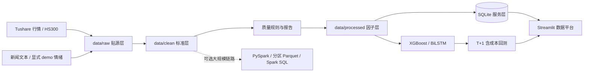

# A 股量化数据工程平台


这是一个从本科毕设演进而来的、可复现的量化数据开发项目。它覆盖行情采集、数据清洗、质量校验、因子加工、SQLite 服务层、机器学习、T+1 回测和 Streamlit 数据平台。原始数据、模型和结果均由流水线生成，不再提交大文件到 Git。

项目重点不是展示一条“漂亮收益曲线”，而是展示一套可信的数据链路：明确数据来源、隔离训练/验证/测试集、使用真实基准或诚实标注降级基准、计入交易费用，并通过测试和 CI 防止回归。

## 一分钟体验

无需 Token，生成确定性的演示数据并跑通完整数据链路：

```bash
cd projects/01-a-stock-quant-analysis
python -m venv .venv
.venv\Scripts\activate
pip install -r requirements.txt
python scripts/prepare_demo.py
python -m streamlit run app_pro.py
```

演示模式会生成 6 只股票、约 520 个交易日的数据，并明确写入 `synthetic_demo` 来源标签。应用默认直接进入平台；如需展示登录模块，设置 `QUANT_REQUIRE_LOGIN=1`。

## 在线作品集部署

仓库包含一个使用固定随机种子生成的轻量演示数据包：50 只模拟股票、最近 3 年数据。它不复制或再分发 Tushare/AKShare 的逐日行情。完整真实数据库、原始行情、用户库和凭证仍不会提交到 Git。

克隆仓库后，如果本地没有完整研究数据，应用会自动进入公开作品集模式：

- 访客无需注册即可浏览全部只读页面；
- 自选股只保存在当前浏览会话；
- 页面明确显示合成演示行情、数据水位和非投资建议口径；
- 不加载或写入本地用户数据库；
- 不需要 Tushare Token。

部署到 Streamlit Community Cloud 时，选择入口文件：

```text
projects/01-a-stock-quant-analysis/app_pro.py
```

如需在有完整本地数据的环境中强制预览公开模式：

```powershell
$env:QUANT_APP_MODE = "portfolio"
python -m streamlit run app_pro.py
```

重新生成轻量合成数据包：

```powershell
python scripts/build_portfolio_dataset.py --stocks 50 --years 3
```

## 架构与数据血缘



| 数据层 | 位置 | 设计目的 |
|---|---|---|
| Raw / ODS | `data/raw/` | 保留逐股票贴源数据和基准数据，便于追溯 |
| Clean / DWD | `data/clean/` | 字段统一、类型转换、去重、异常过滤 |
| Processed / DWS | `data/processed/` | 技术/情绪因子宽表与模型标签 |
| Serving / ADS | `data/stock_data.db` | 唯一键约束、分块 upsert、参数化查询，供看板消费 |

## 工程能力

- 数据采集：Tushare 主链路；无 Token 时可用 AKShare/Sina 做可校验的增量行情与沪深 300 更新，Token 仅从环境变量读取。
- 数据质量：覆盖行数、股票数、日期范围、重复键、空值率、OHLC 合法性，并输出 JSON 报告。
- 数据库：动态安全建列、`(code, date)` 唯一索引、事务回滚、分块增量 upsert；查询不拼接用户输入。
- 分布式处理：提供 PySpark 清洗、窗口因子、按年份分区 Parquet 和 Spark SQL 聚合链路。
- 模型可信度：XGBoost 使用时间序列滚动验证；BiLSTM 按时间拆分 70/15/15，验证集用于早停，测试集只做最终评估。
- 回测可信度：T 日信号对应 T+1 收益；支持佣金、印花税、换手率；优先读取真实沪深 300，缺失时明确显示“股票池等权基准”。
- 来源治理：真实新闻与合成演示情绪严格区分；网络失败不会悄悄生成随机数据。
- 基础安全：外部 SQL 输入参数绑定；演示账号使用带随机盐的 PBKDF2 摘要，并自动迁移旧摘要。
- 可维护性：8 项单元/集成测试、Python 3.10/3.11 GitHub Actions、可移植 Windows 启动脚本。

## 数据平台页面

Streamlit 首页改造成紧凑的专业数据平台，集中展示数据层状态、数据新鲜度、质量通过率和来源分布；同时保留市场概览、因子分析、情绪分析、模型预测与策略回测模块。

<p align="center">
  
</p>

> 仓库内截图可能来自早期版本。运行演示流水线后可查看当前专业主题与数据平台首页。

## 目录结构

```text
01-a-stock-quant-analysis/
├── app_pro.py                            # Streamlit 数据平台
├── fetch_stock_data.py                   # 行情与 HS300 基准采集
├── fetch_sentiment.py                    # 真实/演示情绪采集（显式模式）
├── data_preprocessing.py                 # Raw → Clean
├── data_quality.py                       # 质量规则和 JSON 报告
├── factor_engineering_with_sentiment.py  # Clean → 因子 → SQLite
├── database_manager.py                   # 约束、upsert、参数化查询
├── spark_pipeline.py                     # 可选 PySpark 批处理链路
├── model_training.py                     # XGBoost / BiLSTM 时间序列训练
├── backtest.py                           # T+1、成本与真实基准回测
├── scripts/prepare_demo.py               # 一键可复现 Demo
├── scripts/update_market_data_akshare.py  # 无 Token 增量更新与跨源校验
├── scripts/rebuild_serving_database.py   # 校验、备份并原子重建 SQLite
├── scripts/smoke_test_app.py             # 逐页 Streamlit 冒烟测试
├── sql/analytics_queries.sql             # 分析 SQL
├── tests/                                # 单元与端到端测试
├── requirements.txt                      # 核心依赖
├── requirements-model.txt                # 离线模型训练重依赖
└── requirements-spark.txt                # 可选 Spark 依赖
```

## 使用真实数据

需要训练模型时先安装额外依赖，然后设置 Tushare Token：

```powershell
pip install -r requirements-model.txt
$env:TUSHARE_TOKEN = "你的 Token"
python fetch_stock_data.py
python fetch_sentiment.py --mode real
python data_preprocessing.py
python factor_engineering_with_sentiment.py
python model_training.py
python backtest.py
```

如果只想演示情绪链路，必须显式执行 `python fetch_sentiment.py --mode demo`。

已有历史数据但暂时没有 Tushare Token 时，可执行：

```powershell
python scripts/update_market_data_akshare.py
python data_preprocessing.py
python factor_engineering_with_sentiment.py
python scripts/rebuild_serving_database.py
python model_training.py
python backtest.py
```

更新脚本会对新旧数据重叠区间做价格/成交量/成交额口径校验，并把来源、失败列表、日期范围写入运行清单。没有明确来源的旧情绪数据标为 `legacy_unknown`，不会进入模型训练。

| 环境变量 | 说明 |
|---|---|
| `TUSHARE_TOKEN` | Tushare 凭证，不写入仓库 |
| `STOCK_DATA_START_DATE` | 采集起始日，格式 `YYYYMMDD` |
| `STOCK_DATA_END_DATE` | 采集结束日，默认当前日期 |
| `QUANT_REQUIRE_LOGIN` | 设为 `1` 时启用演示登录模块 |

## PySpark 链路

```bash
pip install -r requirements-spark.txt
python spark_pipeline.py
```

该链路适合说明从单机 Pandas/SQLite 向大数据场景演进的思路，但项目不虚构 Kafka、Flink 等尚未落地的组件。

## 验证

```bash
python -m unittest discover -s tests -v
python -m compileall -q -x "archive" .
python scripts/smoke_test_app.py
```

CI 会在 Python 3.10 和 3.11 上执行相同检查。演示数据、数据库、模型、日志和回测产物均被 `.gitignore` 排除。

如果历史 SQLite 缺少行情字段，可运行 `python scripts/rebuild_serving_database.py`。脚本会先备份旧库，校验新库的字段与行数，再原子替换服务层；页面也会在 SQLite 不完整时自动回退到 Processed Parquet。

## 关于实验结果

旧毕设版本曾记录过模型和收益指标，但原回测把股票池等权收益误写为“沪深 300”，且未真实扣除交易成本，因此不再把这些数字作为当前版本结论。请运行修正后的训练和回测，以 `training_log.json` 与 `backtest_results/backtest_metrics.csv` 为本地结果来源；页面会同步显示基准来源与成本参数。

2026-08-30 的本地真实数据验收覆盖 364 只股票、562,789 条因子记录（2020-01-07 至 2026-08-28），重复主键与非法 OHLC 均为 0。按时间切分后，XGBoost 测试准确率 51.97%、AUC 0.5204；BiLSTM 准确率 51.80%、AUC 0.5162。Walk-Forward 策略在 2023-01-03 至 2026-08-27 计入佣金、印花税和换手成本后总收益 5.51%，同期沪深 300 为 18.55%，超额 -13.04%，最大回撤 -23.82%。结论是当前技术因子只有很弱的统计信号，尚不具备实盘优势；项目价值在于可追溯的数据工程、无泄漏验证和诚实的研究结论，而不是包装收益。

## 岗位能力映射

| 目标岗位 | 可重点讲解的内容 |
|---|---|
| 量化数据开发 | 金融数据接入、因子宽表、时序隔离、基准与交易成本 |
| 数据开发 | 分层模型、增量 upsert、质量规则、PySpark、分区 Parquet、CI |
| 数据分析 / BI | 指标口径、分析 SQL、质量看板、交互式可视化、结论边界 |
| Python 数据岗 | 模块化流水线、异常处理、配置化、测试和可复现 Demo |

## 局限与下一步

- 日频技术因子预测信号较弱，不构成实盘依据。
- 当前 SQLite 服务层适合单机分析；分钟/Tick 级数据可演进至 ClickHouse 或 Doris。
- 回测已考虑基础交易费用，但仍未完整模拟涨跌停、停牌、滑点和市场冲击。
- 下一步可加入基本面 PIT 数据、任务调度、数据质量告警和容器化部署。

> 本项目仅用于学习、求职展示和技术研究，不构成投资建议。

## License

[MIT](LICENSE)
