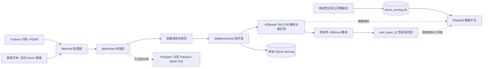

# A 股量化数据工程与研究分析平台


## 项目简介

这是一个面向量化分析、数据分析和 AI 算法岗位的量化研究作品集。项目把数据工程、因子研究、机器学习预测、策略回测和 Streamlit Dashboard 串成一条可追溯的研究流程：先完成行情数据的分层处理和质量校验，再构建技术因子，使用 XGBoost 与 BiLSTM 验证下一交易日涨跌方向，最后用符合交易时序的 `next_open_v2` 回测检验信号能否转化为可执行结果。

项目重点是解释研究过程和边界，而不是包装收益率。模型指标接近随机基线，回测结果为负，这些结果会在 Dashboard 和文档中如实展示，便于面试时说明数据口径、实验设计、交易成本和失败原因。

## 项目定位

这是一个面向量化研究的数据工程与分析作品集：覆盖行情接入、分层清洗、质量校验、因子加工、SQLite 服务、离线模型实验、`next_open_v2` 回测和 Streamlit 展示。项目目标是让数据与研究过程可追溯、可复现、可解释，不把弱模型或负收益包装成可交易策略。

## Live Demo

**在线演示：<https://a-stock-quant-data-platform.streamlit.app/>**

在线版本使用确定性合成数据和本地真实研究结果的脱敏摘要。访客无需 Tushare Token，页面不会执行在线训练或实盘交易。Streamlit Community Cloud 的入口文件为：

```text
projects/01-a-stock-quant-analysis/app_pro.py
```

## Architecture

### 研究流程

```text
数据工程
    ↓
数据分析
    ↓
因子研究
    ↓
机器学习
    ↓
策略回测
    ↓
Dashboard
```

这条主线对应项目中的数据处理、分析聚合、因子构建、分类实验、`next_open_v2` 执行模拟和 Streamlit 展示模块。



## 核心能力模块

### Data Engineering

- 数据采集：接入 Tushare 主链路，并保留可校验的增量更新路径。
- 数据清洗：按 Raw、Clean、Processed 分层处理行情和研究字段。
- 数据质量检查：检查缺失、重复主键、日期、OHLC、价格和成交量异常。
- SQLite 存储：使用约束、索引、事务化 upsert 和参数化查询提供本地服务层。

### Factor Research

- 21 个正式模型输入技术因子，覆盖趋势、动量、波动和成交量等维度。
- 因子分析：查看个股因子走势和代表性技术指标。
- 相关性分析：通过因子相关性矩阵和 IC 结果诊断因子之间的关系。

### Machine Learning

- XGBoost：作为树模型基线，预测下一交易日涨跌方向。
- BiLSTM：作为深度学习对照模型，使用时间序列窗口进行分类实验。
- 时间切分验证：统一股票池、特征集合和时间边界，避免随机切分造成信息泄露。

### Backtesting

- T 日收盘生成信号，T+1 开盘执行调仓。
- 使用佣金、印花税和滑点构成交易成本模型。
- 记录策略收益、基准收益、超额收益、最大回撤、Sharpe、换手率和成交阻塞。

数据分层：

| 数据层 | 位置 | 作用 |
|---|---|---|
| Raw / ODS | `data/raw/` | 保存逐股票贴源行情和基准，便于追溯 |
| Clean / DWD | `data/clean/` | 字段统一、类型转换、去重和异常过滤 |
| Processed / DWS | `data/processed/` | 技术因子、可验证情绪因子与下一交易日标签 |
| Serving / ADS（本地） | `data/stock_data.db` | 完整研究数据的约束、upsert 和参数化查询 |
| Serving / ADS（公开） | `portfolio_data/demo_serving.db` | 合成维表、明细、聚合、质量与运行记录，供页面只读查询 |

## Current Research Results

以下是唯一当前研究口径。模型指标来自本地真实研究因子表；回测使用同一轮 XGBoost 样本外概率和真实行情开盘价。公开 Demo 只展示对应的脱敏快照。

### 模型实验

任务统一为预测下一交易日涨跌。XGBoost 与 BiLSTM 使用相同股票池、21 个技术特征、70%/15%/15% 时间切分和完整 83,259 个测试目标；两个会跨区间引用下一日标签的边界信号日已经剔除。

| 模型 | Accuracy | AUC | Precision | Recall | F1 |
|---|---:|---:|---:|---:|---:|
| XGBoost | 52.71% | 0.5276 | 49.06% | 42.43% | 45.50% |
| BiLSTM | 51.43% | 0.5185 | 47.83% | 48.22% | 48.03% |

BiLSTM 使用相同数据范围构造 20 日序列；为适配普通笔记本，从 381,668 个训练序列中按固定规则等距选取 120,000 个。验证集 82,941 个目标和测试集 83,259 个目标均完整评估。这一训练样本量差异属于实验限制。

### `next_open_v2` 回测

T 日收盘生成信号，T+1 开盘调仓并跨日持有。成本模型包含买卖双边 0.03% 佣金、卖出单边 0.05% 印花税和买卖各 0.10% 固定滑点。

| 指标 | 当前结果 |
|---|---:|
| 策略收益 | -28.31% |
| 沪深 300 开盘基准 | +2.18% |
| 超额收益 | -30.49% |
| 最大回撤 | -37.32% |
| Sharpe | -0.88 |
| 平均换手率 | 77.95% |
| 已成交订单 | 4,042 笔 |
| 缺少开盘价阻塞 | 1 笔 |

当前模型没有证明稳定预测能力，当前策略也没有获得超额收益。高换手和交易成本进一步放大了弱信号问题。

## Dashboard 截图

截图区域按面试讲解顺序保留五个页面。当前仓库已有的图片直接引用；尚未生成的页面明确保留截图位，不用占位图冒充最终界面。

| 页面 | 展示重点 | 截图状态 |
|---|---|---|
| System Overview | 数据工程到 Dashboard 的六阶段 Pipeline | 待补充：`docs/screenshots/system_overview.png` |
| Data Platform | 数据资产规模、数据质量和服务层状态 | 待补充：`docs/screenshots/data_platform.png` |
| Factor Research | 21 个技术因子、价格走势和相关性分析 | 已有：见下方截图 |
| Model Validation | XGBoost / BiLSTM 的统一分类实验结果 | 已有：见下方截图 |
| Strategy Backtest | `next_open_v2` 净值曲线、基准和回撤 | 已有：见下方截图 |

### Factor Research


### Model Validation


### Strategy Backtest


结果来源：本地 `training_log.json`、`backtest_results/backtest_metrics.csv`；公开快照 `portfolio_data/portfolio_training_log.json`、`portfolio_data/portfolio_backtest_metrics.csv` 和 `portfolio_data/portfolio_backtest_results.csv`。

## Data Scope

| 口径 | 数据与规模 | 用途 | 是否进入当前结果 |
|---|---|---|---|
| 本地真实研究数据 | Tushare 历史行情，必要时使用 AKShare/Sina 增量更新；验收快照覆盖 364 只股票、562,789 条因子记录 | 因子研究、模型训练与回测 | 是 |
| 公开 Demo 数据 | 固定随机种子生成的 5,200 个合成资产目录、300 个合成资产明细及市场/行业聚合 | 页面展示、SQLite 查询和部署复现 | 否 |
| 模型结果 | 本地真实研究数据训练后的脱敏评价指标和 XGBoost Top 10 特征重要性 | 展示模型验证结论 | 是 |
| 回测结果 | XGBoost 样本外概率、真实行情开盘价和沪深 300 开盘基准生成的脱敏指标与归一化净值 | 展示研究闭环 | 是 |

公开 Demo 中的“5,200 个资产”是合成资产标识目录，不代表 5,200 只真实股票，也不是实时行情。完整原始数据、研究数据库、模型权重、逐行预测、逐日持仓、用户库和凭证不会进入 Git。

## Engineering Highlights

- 数据接入：Tushare 主链路；AKShare/Sina 用于无 Token 场景下的可校验增量更新，Tushare Token 只从环境变量读取。
- 数据质量：检查覆盖范围、重复主键、缺失率、OHLC 合法性、价格与成交量，并输出可读 JSON 报告。
- 数据服务：SQLite 使用 `(code, date)` 唯一约束、事务化分块 upsert、参数化查询和索引；公开页面按需查询服务库。
- 模型验证：两个现有分类模型共用时间边界与测试目标；scaler 只在训练集拟合；测试集只做最终评估。
- 回测执行：只接受统一分类概率文件；不使用真实标签补造收益；记录成本、换手、阻塞订单和基准来源。
- 公开数据治理：真实研究规模、公开查询规模和合成数据来源分别展示；网络失败不会自动生成伪真实数据。
- 可选批处理：PySpark 实现清洗、窗口因子、分区 Parquet 和 Spark SQL 聚合，用于说明批处理迁移思路。
- 质量保障：单元测试、数据链路测试、Streamlit 十页烟雾测试和 GitHub Actions CI。

## Research Limitations

- 当前日频技术因子的 AUC 接近 0.5，没有证明稳定预测能力。
- 当前 Top-N 策略收益和超额收益均为负，不应解释为可实盘交易的策略。
- 固定滑点不能替代真实盘口、成交量约束和市场冲击模型。
- 历史股票池、退市样本、复权口径、停牌和逐日涨跌停状态仍不完整，存在幸存者偏差与可交易性边界。
- 来源未验证的情绪数据被排除，当前结果不能证明情绪因子有效。
- PySpark 是可选批处理实现，不是生产 Spark 集群运行证据。
- 当前没有 Kafka、Flink 或 Airflow 生产链路。
- SQLite 和 Streamlit 适合作品集与单机分析服务，不能描述为生产级量化交易系统。
- 本项目是量化数据工程与研究分析平台，不是 AI 交易机器人，不构成投资建议。

## Testing

在项目目录执行：

```powershell
python -m py_compile model_training.py backtest.py app_pro.py
python -X pycache_prefix="$env:TEMP\quant-phase4-pycache" -m compileall -q -x "archive([\\/]|$)" .
python -m pytest -q
$env:QUANT_APP_MODE = "portfolio"
python scripts/smoke_test_app.py
```

Phase 4 本地验收目标与当前结果：Python 语法检查通过，`compileall` 通过，26 项测试及 5 项参数化子测试通过，10 个现有 Streamlit 页面通过公开模式烟雾测试。CI 工作流位于仓库根目录 `.github/workflows/quality.yml`。

## 本地快速体验

无需 Token 即可运行确定性小型 Demo：

```powershell
cd projects/01-a-stock-quant-analysis
python -m venv .venv
.venv\Scripts\activate
pip install -r requirements.txt
python scripts/prepare_demo.py
python -m streamlit run app_pro.py
```

小型 Demo 会生成 6 个合成资产、约 520 个交易日，并写入 `synthetic_demo` 来源标签。如需展示本地登录模块，设置 `QUANT_REQUIRE_LOGIN=1`。

在没有完整研究数据时，应用自动进入公开作品集模式：访客只读浏览，模型页显示离线评价快照，回测页显示脱敏指标和归一化曲线，不加载模型权重或用户数据库。

## 使用本地真实研究数据

```powershell
pip install -r requirements-model.txt
$env:TUSHARE_TOKEN = "你的 Token"
python fetch_stock_data.py
python fetch_sentiment.py --mode real
python data_preprocessing.py
python factor_engineering_with_sentiment.py
python model_training.py
python backtest.py
```

暂时没有 Tushare Token 时，可以对已有历史数据执行 `scripts/update_market_data_akshare.py`，随后重新运行清洗、因子、数据库、训练和回测链路。情绪演示必须显式使用 `python fetch_sentiment.py --mode demo`；来源为 `legacy_unknown` 的情绪记录不会进入训练。

## 目录结构

```text
01-a-stock-quant-analysis/
├── app_pro.py                            # Streamlit 数据平台
├── app/                                  # 查询、股票画像和行业分析
├── data/                                 # Raw / Clean / Processed 本地分层
├── portfolio_data/                       # 可提交的合成服务库与脱敏快照
├── reports/                              # 可提交的质量、性能与模型摘要
├── model_training.py                     # XGBoost / BiLSTM 统一分类实验
├── backtest.py                           # next_open_v2 回测
├── database_manager.py                   # SQLite 约束、upsert 与查询
├── spark_pipeline.py                     # 可选 PySpark 批处理
├── scripts/                              # Demo、建库、更新、基准和烟雾测试
├── sql/                                  # 服务库结构与分析 SQL
├── tests/                                # 单元与链路测试
├── requirements.txt                      # 公开网站运行依赖
├── requirements-data.txt                 # 本地数据采集依赖
├── requirements-model.txt                # 离线模型训练依赖
└── requirements-spark.txt                # 可选 PySpark 依赖
```

## 面试讲解重点

| 目标岗位 | 建议重点 |
|---|---|
| 量化数据开发 | 数据来源、因子宽表、时间隔离、可执行回测、成本与研究边界 |
| 数据开发 | 分层数据、质量规则、增量 upsert、参数化查询、PySpark 批处理、CI |
| 数据分析 / BI | 指标口径、公开与本地数据差异、弱结果解释、交互式展示 |
| Python 数据岗 | 模块化流水线、异常处理、配置、测试和可复现 Demo |

完整方法、结果和限制见仓库根目录的 `MODEL_EXPERIMENT_DESIGN.md`、`MODEL_RETRAIN_REPORT.md`、`BACKTEST_METHODOLOGY.md` 与 `RESEARCH_RESULT_SUMMARY.md`。

## License

[MIT](LICENSE)
